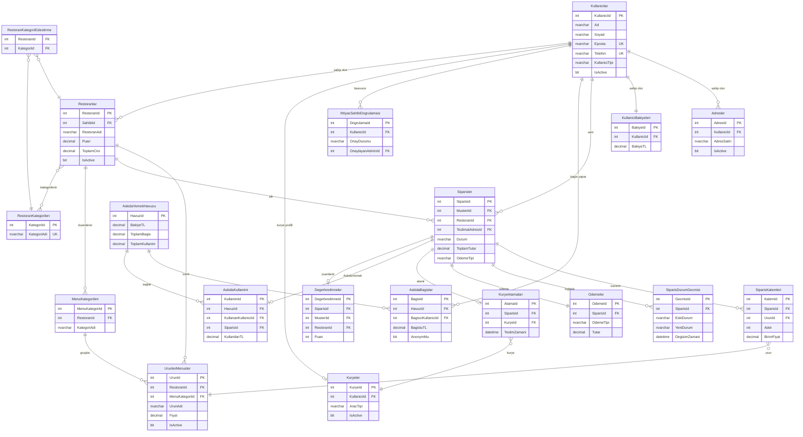

# ER Diyagramı — Çevrimiçi Yemek Sipariş Platformu

## Tablo İlişkileri (Mermaid ERD)

## İlişki Kardinaliteleri Açıklaması

| İlişki | Tür | Açıklama |
|---|---|---|
| Kullanicilar → Adresler | 1:N | Müşterinin birden fazla adresi olabilir |
| Kullanicilar → KullaniciBakiyeleri | 1:1 | Her kullanıcının tek cüzdanı |
| Restoranlar ↔ RestoranKategorileri | M:N | Köprü: RestoranKategoriEslestirme |
| Siparisler → SiparisKalemleri | 1:N | Sepette birden fazla ürün |
| Siparisler → KuryeAtamalari | 1:1 | Bir siparişe tek kurye |
| AskidaYemekHavuzu → AskidaBagislar | 1:N | Havuz birden fazla bağış alır |
| AskidaKullanimi → Siparisler | 1:1 | Bir sipariş max 1 kez askıda kullanılır |

## 3NF Uyumluluk Notu

- **1NF**: Tüm kolonlar atomik değer tutar, tekrarlayan grup yoktur.
- **2NF**: Tüm non-key kolonlar tam PK'ya bağımlıdır (bileşik PK olan `RestoranKategoriEslestirme` dahil).
- **3NF**: Geçişli bağımlılık yoktur — örneğin `Restoranlar.Puan`, `RestoranId`'ye bağlıdır, başka bir non-key kolona değil.
